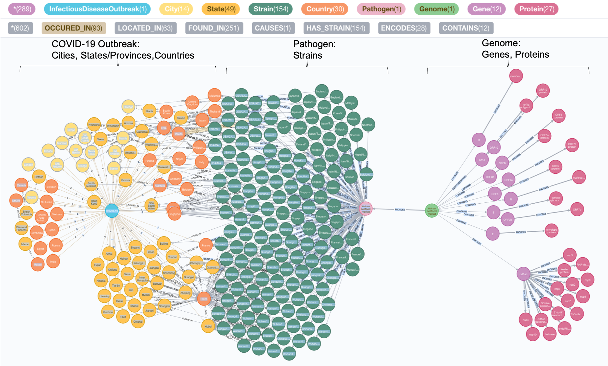
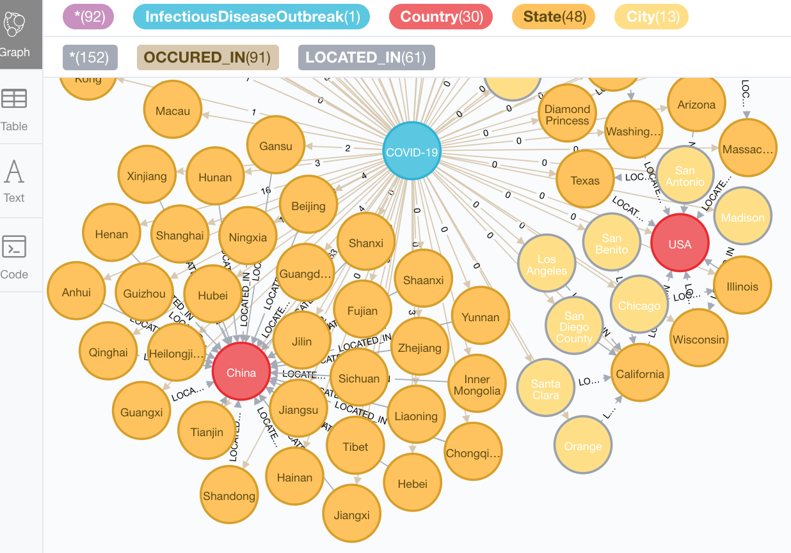
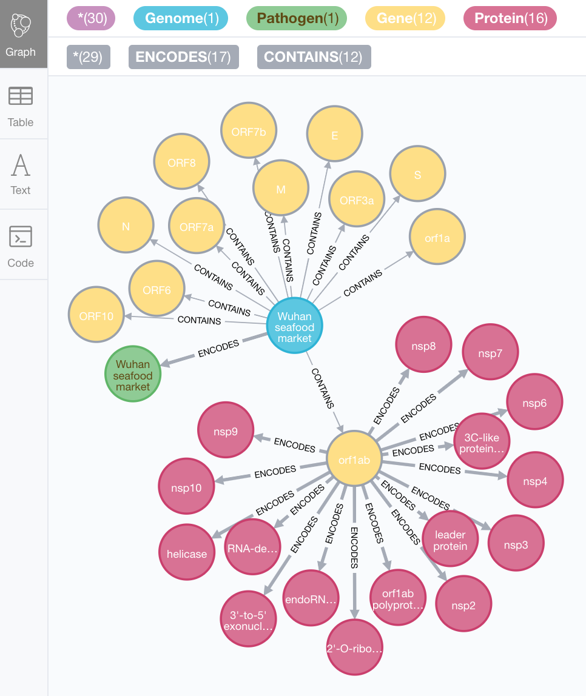
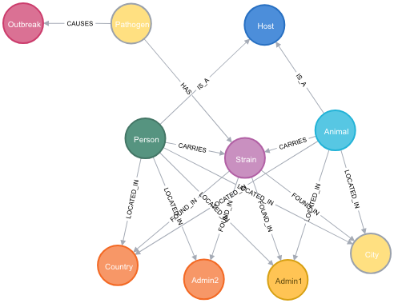

# Coronavirus-Knowledge-Graph
Prototype to create a [Neo4j](https://neo4j.com/) Knowledge Graph for Coronavirus outbreaks. 

The goal of this Knowledge Graph project is to link heterogeneous data from publically available resources relevant to the COVID-19 outbreak. By linking disparate datasets, new insights may be gained.

Currently, this project integrates data from:
* Daily reported COVID-19 cases from [Coronavirus COVID-19 Global Cases by Johns Hopkins CSSE](https://github.com/CSSEGISandData/COVID-19)
* Real-time tracking of COVID-19 evolution from [Nextstrain](https://github.com/nextstrain/ncov)
* Genome, gene, and protein data from [NCBI](https://www.ncbi.nlm.nih.gov/nuccore/NC_045512)

The initial focus of this repo is on the Novel Coronavirus COVID-19 (2019-nCoV). In the future we will include data for SARS and MERS.

## How to use this project?

1. Launch this repo on [MyBinder.org](https://mybinder.org/). Binder lets you run Jupyter Notebooks in your web browser without software installation.

2. Once Jupyter Lab launches (this may take a couple of minutes), navigate to the notebooks directory.

3. Run the following Jupyter Notebooks:

* 1-PrepareDatasets.ipynb (downloads public data about COVID-19)

* 2-CreateKnowledgeGraph (creates a Neo4j Knowledge Graph)

* 3-AddGeneProteinInfo (adds genome, gene, and protein information)

* 4-ExampleQueries (runs [Cypher](https://neo4j.com/developer/cypher-query-language/) queries on the Knowledge Graph)

## Coronavirus KG Views displayed in Neo4j Browser

Fig. 1: The whole Coronavirus KG

Fig. 2: Outbreaks by Country, State/Province, and City

Fig. 3: Pathogen, Genome, Genes, and Proteins

Fig. 4: Strains found in Hubei province

## How can you help?

* Suggest complementary publically accessible datasets to include in this Knowledge Graph
* Suggest queries and analyses
* Report bugs or issues
* Submit a pull request

Please send [feedback or feature requests](https://github.com/sbl-sdsc/coronavirus-knowledge-graph/issues/new).

